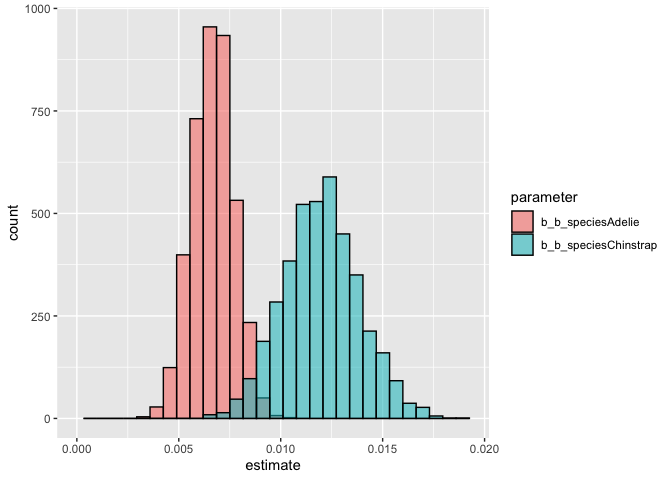

Activity 13: Statistical reasoning 5: handling complexity using interactions
================

Welcome! This is the fifth statistical reasoning activity. The goals of
this activity are to understand how to implement and interpret
*interactive* models (of multiple regression).

------------------------------------------------------------------------

You will submit one output for this activity:

1.  A **PDF** of a rendered Quarto document with all of your R code.
    Please create a new Quarto document (e.g. don’t use this
    `README.qmd`) and include all of the code that appears in this
    document, your own code, and **answers to all of the questions** in
    the “Q#” sections. Submit this PDF through Gradescope.

A reminder: **Please label the code** in your final submission in two
ways:

1.  denote your answers to each question using headers that correspond
    to the question you’re answering, and
2.  thoroughly “comment” your code: remember, this means annotating your
    code directly by typing descriptions of what each line does after a
    `#`. This will help future you!

------------------------------------------------------------------------

# 1. Interactions

Back when we introduced multiple regression in “Activity 10: Statistical
Reasoning 2 - multiple regression” we looked at the Palmer Penguins
dataset. Included in that activity was this paragraph describing
additive models:

> **This is an additive model**, which means that that the effect of one
> predictor is treated as independent of other predictors. Rephrased,
> this means that this model structure assumes that the effect of bill
> length on bill depth *will not differ between species*. If we think of
> this graphically, it means that this model forces each species to have
> the exact same slope. In our example, this seems like a fine
> assumption: in the graph above, notice that the slopes that
> geom_smooth() puts on the graph are basically parallel (parallel lines
> = equal slopes). If we feel that the slope should actually be
> different for each species, then we would use an *interactive model*
> instead of an *additive model*, but don’t worry about that - we’ll get
> to that later in the quarter!

Guess what? It’s later in the quarter!

------------------------------------------------------------------------

Interactions occur when one the value of one predictor variable
influences the effect of a second predictor on the response. Now, one
predictor is *conditional* on another. For instance, imagine that for
one species of penguin, increasing body mass leads to longer bills,
while for a second species, increasing body mass leads to smaller bills.
Is there a general effect of body mass on bill length? No, because it’s
*conditional*: if species A, then it’s a positive effect, but if species
B, it’s negative. Lots of ecology is like this: “It depends!”

------------------------------------------------------------------------

## Conceptual questions

------------------------------------------------------------------------

### Q1.1 Describe the interaction in the comic

In this XKCD comic below, `productivity` is a function of the
interaction between `power outage` (pre vs post outage) and the
`reliance on internet for work`. In 1-2 sentences, describe how the
power outage interacts with the reliance on internet to affect
productivity.


------------------------------------------------------------------------

### Q1.2 What additional variable would lead to an interaction?

For each of the causal relationships below, name a hypothetical third
variable that would lead to an interaction effect and describe what the
effect would be. For instance, what would cause the effect of e.g. yeast
on the rate of bread rising to increase/decrease?

- Bread dough rises because of yeast.
- Education leads to higher income.
- Gasoline makes a car go.

------------------------------------------------------------------------

## Penguins

We’re going to continue working with the Palmer penguins data to
illustrate how to interpret interactive models. Let’s set up:

``` r
library(tidyverse) # For data wrangling
library(brms) # For stats
library(palmerpenguins) # For the data
library(ggeffects) # for plotting model predictions
```

``` r
# Store the data as penguins
penguins <- palmerpenguins::penguins
```

``` r
# Look at the column names
penguins %>% colnames()
```

    [1] "species"           "island"            "bill_length_mm"   
    [4] "bill_depth_mm"     "flipper_length_mm" "body_mass_g"      
    [7] "sex"               "year"             

------------------------------------------------------------------------

### Q1.3 Filter the dataset to only include Adelie and Chinstrap penguins

Let’s make our lives simple today by only looking at two species: filter
the `penguins` dataset to only include Adelie and Chinstrap penguins.
Use the functions that we learned in the first half of the quarter.
Store the new dataframe as `penguins.AC`

------------------------------------------------------------------------

### Q1.4 Make a plot of flipper length \~ body mass and species

Using ggplot and geom_smooth, make a plot of flipper length on the y
axis with body mass on the x, and color the points by species. Put a
geom_smooth() line on top of the points with a “linear model” (lm) line.

------------------------------------------------------------------------

### Q1.5 Describe the relationships

Describe in 1-2 sentences whether you think the relationship you see is
interactive or additive. In other words, do you think that the effect of
body mass on flipper length is conditional on species? Why do you think
this?

------------------------------------------------------------------------

## Additive model - categorical + continuous

------------------------------------------------------------------------

### Q1.6 Run and assess an additive model

Run and assess an additive model of
`flipper_length_mm ~ 0 + species + body_mass_g` (the zero allows will
provide separate intercepts for each species). Store the model output as
`m.flip.mass.spp.additive`

In your assessment, describe whether or not you think the model ran
well.

------------------------------------------------------------------------

Let’s plot the additive model’s predictions. Remember, the additive
model does not allow for the two effects to interact. Graphically, this
means that it does not allow the slope of one effect to change with
another effect.

``` r
preds.add <- predict_response(m.flip.mass.spp.additive,
                          terms = c("body_mass_g", "species"))

plot(preds.add, show_data = TRUE)
```

------------------------------------------------------------------------

### Q1.7 Interpret the additive model

Interpret the additive model output; in a few sentences, answer:

1.  Which species has longer flippers, and by how much?
2.  What is the effect of body mass on flipper length (remember units),
    and is that effect consistent with zero?
3.  Given the additive model, does the effect of body mass on flipper
    length vary per species?

Something I learned this week is that you can print out more decimal
places in the model output by using the print() function instead of the
summary() function (at least for brms model outputs):

`print(model.name, digits = 4`

------------------------------------------------------------------------

## Interactive model - categorical + continuous

------------------------------------------------------------------------

Now let’s try an interactive model! As in the lecture, we are going to
write this with “non-linear syntax” within the `bf()` function where our
model normally goes.

``` r
# flipper length by body mass and species - INTERACTIVE model
m.flip.mass.spp.interactive <- 
  brm(data = penguins.AC, # Give the model the penguins data
      # Choose a gaussian (normal) distribution
      family = gaussian,
      # Specify the model here. 
      # First, we write the equation with a as an intercept and b as a slope next to body mass
      bf(flipper_length_mm ~ 0 + a + b*body_mass_g,
         # Then, we specify that we want our intercept, a, to vary with species
         a ~ 0 + species,
         # Next, we specify that we want our slope, b, to ALSO vary with species 
         # (this is the interaction part!!)
         b ~ 0 + species,
         # Lastly, we tell it that we are writing in a particular notation
         nl = TRUE),
      # Here's where you specify parameters for executing the Markov chains
      # We're using similar to the defaults, except we set cores to 4 so the analysis runs faster than the default of 1
      iter = 2000, warmup = 1000, chains = 4, cores = 4,
      # Setting the "seed" determines which random numbers will get sampled.
      # In this case, it makes the randomness of the Markov chain runs reproducible 
      # (so that both of us get the exact same results when running the model)
      seed = 4,
      # Save the fitted model object as output - helpful for reloading in the output later
      file = "output/m.flip.mass.spp.interactive")
```

``` r
# Print out the model output with 4 digits to avoid the display rounding to zero
print(m.flip.mass.spp.interactive, digits = 4)
```

     Family: gaussian 
      Links: mu = identity 
    Formula: flipper_length_mm ~ 0 + a + b * body_mass_g 
             a ~ 0 + species
             b ~ 0 + species
       Data: penguins.AC (Number of observations: 219) 
      Draws: 4 chains, each with iter = 2000; warmup = 1000; thin = 1;
             total post-warmup draws = 4000

    Regression Coefficients:
                       Estimate Est.Error l-95% CI u-95% CI   Rhat Bulk_ESS
    a_speciesAdelie    165.2524    3.7694 157.9785 172.4884 1.0022     1949
    a_speciesChinstrap 151.0668    7.0168 136.7167 164.4832 1.0027     1638
    b_speciesAdelie      0.0067    0.0010   0.0047   0.0086 1.0020     1951
    b_speciesChinstrap   0.0120    0.0019   0.0084   0.0158 1.0026     1626
                       Tail_ESS
    a_speciesAdelie        1727
    a_speciesChinstrap     1476
    b_speciesAdelie        1887
    b_speciesChinstrap     1471

    Further Distributional Parameters:
          Estimate Est.Error l-95% CI u-95% CI   Rhat Bulk_ESS Tail_ESS
    sigma   5.7417    0.2724   5.2223   6.2724 1.0005     1965     2070

    Draws were sampled using sampling(NUTS). For each parameter, Bulk_ESS
    and Tail_ESS are effective sample size measures, and Rhat is the potential
    scale reduction factor on split chains (at convergence, Rhat = 1).

We now have four terms in our model: - an intercept (`a`) for Adelie
(165.2524) - an intercept (`a`) for Chinstrap (151.0668) - a slope (`b`)
for Adelie (0.0067) - a slope (`b`) for Chinstrap (0.0120)

It looks like both of our slopes are different from zero; the flipper
length-body mass relationship for Adelie is 0.0067mm/g (95%CI from
0.0047-0.0086) while for Chinstrap it’s nearly doubled at 0.0120mm/g
(95%CI from 0.0084-0.0158).

------------------------------------------------------------------------

## Plot posteriors

Are the two slopes different from one another? If you look at the 95%
CIs, the ranges barely overlap: Adelie goes from 0.0047-0.0086 while
Chinstrap goes from 0.0084-0.0158. We can look at the distributions of
the posterior estimates via the plot function that we use to assess the
model:

``` r
plot(m.flip.mass.spp.interactive)
```


However, it’s hard to tell how much the distributions for the two slopes
overlap though, because the scales are different. Here’s some fun code
to extract the raw posterior values that went into this plot and make
our own plot with the estimates side-by-side:

``` r
# Store posterior parameter estimates
model_posterior_samples <- as_draws_df(m.flip.mass.spp.interactive)

# Wrangle and then plot samples for the slopes (b) specifically
model_posterior_samples %>% 
  # Select the columns we care about (exclude the posterior estimates for the intercepts and sigma)
  dplyr::select(b_b_speciesAdelie, b_b_speciesChinstrap) %>% 
  # Pivot to long format for easy ggplotting
  pivot_longer(cols = everything(),
               names_to = "parameter",
               values_to = "estimate") %>%
  # Plot as a two overlapping histograms, with the fill colored by parameter
  ggplot(aes(x = estimate, fill = parameter)) +
  geom_histogram(alpha = 0.55, color = "black",
                 # position = "identity" makes the histograms overlay each other instead of stack
                 position = "identity") +
  xlim(0, NA)
```



There is only a bit each distribution that overlap, so I feel confident
that the estimates are different, and thus we have two different slopes.

------------------------------------------------------------------------

## Plot model predictions

Let’s plot our model predictions:

``` r
preds.int <- predict_response(m.flip.mass.spp.interactive,
                          terms = c("body_mass_g", "species"))

plot(preds.int, show_data = TRUE)
```


------------------------------------------------------------------------

### Q1.8 Which model has better predictive power?

Using what you learned last week, which model (additive vs interactive)
has better predictive power? Back your answer up with PSIS and WAIC
values.

------------------------------------------------------------------------

# 2. Do it yourself

------------------------------------------------------------------------

Now it’s your turn to run an *interactive* model. Using the
`penguins.AC` filtered dataset, model how `bill_length_mm` varies as a
function of `bill_depth_mm` interacting with `species`.

------------------------------------------------------------------------

### Q2.1 Make a graph

Make a graph that reflects the model you are about to run

------------------------------------------------------------------------

### Q2.2 Set up and run an *interactive* model

Make sure you store your model output as something informative to you.

------------------------------------------------------------------------

### Q2.3 Assess the model

Assess whether the model ran correctly by looking at R hat, the chains,
and the posterior distributions. Describe your thought process about
whether the model ran correctly in 1-2 sentences.

------------------------------------------------------------------------

### Q2.4 Plot model predictions

Plot the model predictions using `predict_response()`

------------------------------------------------------------------------

### Q2.5 Plot posteriors

Plot the model posteriors for the two slope values by adapting the code
provided in the “Plot posteriors” to your current model. Ask Calvin or
Malin if you need help!

------------------------------------------------------------------------

### Q2.6 Interpret the model

Interpret your model by answering:

1.  How does bill depth influence bill length, and how does it differ by
    species? Remember to describe the effect using the units to make it
    biologically meaningful.
2.  Does it seem like the slope estimates are different from zero? Why?
3.  Does it seem like the slope estimates are different from one another
    (e.g. do Adelie and Chinstrap penguins have different slopes)? Why?

------------------------------------------------------------------------

### Q2.7 Which model has better predictive power?

Using what you learned last week, which model (additive vs interactive)
has better predictive power? Back your answer up with PSIS and WAIC
values.

------------------------------------------------------------------------

### Render to PDF

When you have finished, remember to pull, stage, commit, and push with
GitHub:

- Pull to check for updates to the remote branch
- Stage your edits (after saving your document!) by checking the
  documents you’d like to push
- Commit your changes with a commit message
- Push your changes to the remote branch

Then submit the well-labeled PDF on Gradescope. Thanks!
